<div align="center">


<br />

### *You bring one line, or nothing at all. It writes the whole roleplay.*

A SillyTavern extension that generates a **complete, linked roleplay**: the premise, the character card,
openings, a lorebook that actually fires, a prompt preset, formatting regex, Quick Reply buttons and image prompts.
Then it critiques its own work and fixes it. You steer; the AI writes.

<br />

[](https://github.com/SillyTavern/SillyTavern)
[](#-install-in-thirty-seconds)
[](#-for-tinkerers)
[](LICENSE)

**[Install](#-install-in-thirty-seconds)** &nbsp;·&nbsp;
**[How it works](#-how-it-works)** &nbsp;·&nbsp;
**[Tour](#-the-tour)** &nbsp;·&nbsp;
**[Which AI?](#-which-ai-does-it-use)** &nbsp;·&nbsp;
**[FAQ](#-faq)**

</div>

<br />

<div align="center"></div>

## ✦ The pitch

Writing a good SillyTavern roleplay is a lot of work: a card with a voice, a first message that hands you a
scene, alternate openings, a lorebook with keys that trigger, a preset that keeps the model in line, regex to
tidy the output, a few Quick Reply buttons… Most people have one good idea and none of the patience.

**Creative Studio does all of it.** Type a sentence, or press **Surprise me**, and watch it build:

<div align="center">
  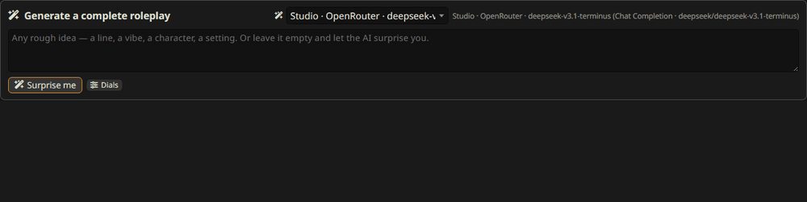
  <br />
  <sub><i>A real run with an empty idea box: DeepSeek V3.1 through OpenRouter came up with</i> Prometheus in the Gloom <i>(scavengers, a sentient AI, a corporate retrieval team) in 2 min 45 s. Sped up; nothing staged.</i></sub>
</div>

<br />

Every piece lands as a real, editable artifact, already linked together: the lorebook to the character, the
preset to the story, the Quick Replies to the card. When you like it, one click sends everything into SillyTavern.
The studio shows the plan first and backs up anything it would overwrite.

<div align="center"></div>

## ✦ Install in thirty seconds

You need **SillyTavern 1.19.0 or newer**. No server plugin, no build step, no `npm install`.

1. In SillyTavern, open **Extensions** (the stacked-blocks icon in the top bar).
2. Click **Install extension** and paste this URL:

   ```
   https://github.com/rustyorb/SillyTavern-CreativeStudio
   ```

3. Pick *Install just for me* or *for all users*. SillyTavern downloads it and reloads.
4. Open it from the **wand menu → Creative Studio**, press **Ctrl + Shift + S**, or type `/studio`.

That's it. It uses the AI connection you already have set up (see [Which AI?](#-which-ai-does-it-use)).

> **Updating:** Extensions → *Manage extensions* → Creative Studio → **Update**.
> **Removing:** the same menu → **Delete**. Your projects stay in your SillyTavern user files.

<details>
<summary><b>Manual install (no internet on the SillyTavern machine, or you like git)</b></summary>

<br />

```bash
cd SillyTavern/data/default-user/extensions
git clone https://github.com/rustyorb/SillyTavern-CreativeStudio
```

Use `public/scripts/extensions/third-party/` instead to install it for every user. Then reload SillyTavern.
</details>

<div align="center"></div>

## ✦ How it works

<div align="center">
  
</div>

<br />

Ten steps, each one a structured AI call whose output becomes a real SillyTavern artifact:

| Step | What the AI writes | Where it ends up |
|---|---|---|
| **Premise** | Title, logline, setting, tone, *your* role, the conflict already in motion | Project brief (every later step reads it) |
| **Character** | A concept with a voice, a contradiction, a motive, a secret and pressure | New character |
| **Card** | Description, personality, scenario, first message, example dialogue, tags | Character Card V3 fields |
| **Openings** | Alternate greetings, each a *different* situation | `alternate_greetings` (swipes on the first message) |
| **Lorebook** | Places, people, factions and rules, with keys that fire in real chat | Linked World Info book |
| **Preset** | Prompt Manager prompts that fit this story, with placement | Chat Completion preset |
| **Regex** | Formatting helpers (hide thinking, strip OOC…), each with test cases | Character-scoped regex; the tests become fixtures |
| **Quick Replies** | Story tools as STscript buttons, checked by SillyTavern's own parser | Quick Reply set linked to the character |
| **Images** | Avatar, full-body and scene prompts | Ready for ST's Image Generation, or any image tool |
| **Polish** | A strict self-critique; concrete fixes get applied | Revised fields + notes you can read |

**It is built to finish.** If the model skips part of an answer, the step asks again for exactly what is missing.
If a provider hangs, the call times out and the step retries once. If something still fails, only the steps that
depend on it wait, and **Resume** picks up where it stopped. The whole run is one **Ctrl+Z** away, and **Discard**
removes everything it made.

### Hands-free or Review: you choose

| | **Hands-free** (default) | **Review** |
|---|---|---|
| AI output | Lands in your project immediately | Waits as a proposal in the inspector |
| You | Read, play, undo anything with Ctrl+Z | Accept, revise or reject each change, with a diff |
| Good for | "Just make me something good" | Polishing a card you care about |

Toggle it any time with the **Hands-free / Review** pill in the top bar. Either way, every AI change is logged with
the model, the prompt and the time it was made.

<div align="center"></div>

## ✦ What one line made

The idea we typed:

> *A lighthouse keeper on a storm-bound northern island who secretly helps smugglers, and I am the new coast guard
> inspector who just arrived.*

About five minutes later, with DeepSeek V3.1 via OpenRouter:

- **Premise:** *The Keeper's Signal*. A coast guard inspector has to uncover the truth about a reclusive keeper
  who is secretly the linchpin of a smuggling operation on a remote, storm-lashed island.
- **Character:** **Cillian Valour**. Late fifties, "carved by the sea and solitude", loyal to the islanders,
  morally flexible for a cause he thinks is just. Plus three alternate openings.
- **Lorebook:** ten entries, including *Serpent's Maw* (the hidden mooring), *Captain Rostov*, the *Sea-Serpent*,
  the light signals, and the VHF radio "that poses a constant eavesdropping risk".
- **Preset:** a main prompt plus *Keeper Directive* and *Tone & Continuity Reminder* prompts.
- **Regex:** *Hide Model Thinking* and *Strip User OOC Notes*, both with passing tests.
- **Quick Replies:** *Continue*, *Summarize Scene*, *Log Suspected Drop*, *Roll Storm Severity*.
- **Images:** avatar, full-body and background prompts.
- **Polish:** a self-critique that caught the first message giving away the smugglers' captain too early.

A taste of the first message:

> The storm hammered against the thick glass of the lantern room, each gust making the ancient iron frame groan.
> (…) *"So. Are you going to help me keep the light burning, Inspector, or are you just going to watch?"*

<div align="center"></div>

## ✦ The tour

It is a full workbench, not just a generator. Everything the AI makes stays editable by hand, and every
workshop has its own **AI buttons** for when you only want one piece.

<table>
<tr>
<td width="50%" valign="top">
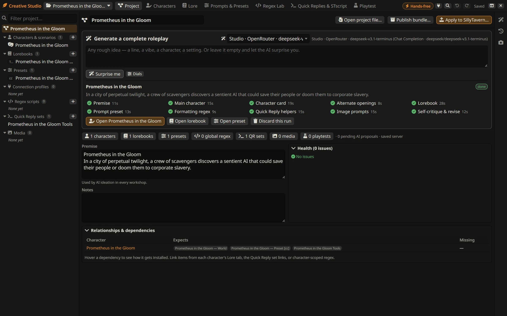
<b>Generate</b>: one idea (or none), optional dials for genre, tone, rating and POV, pick the steps, watch it build.
</td>
<td width="50%" valign="top">
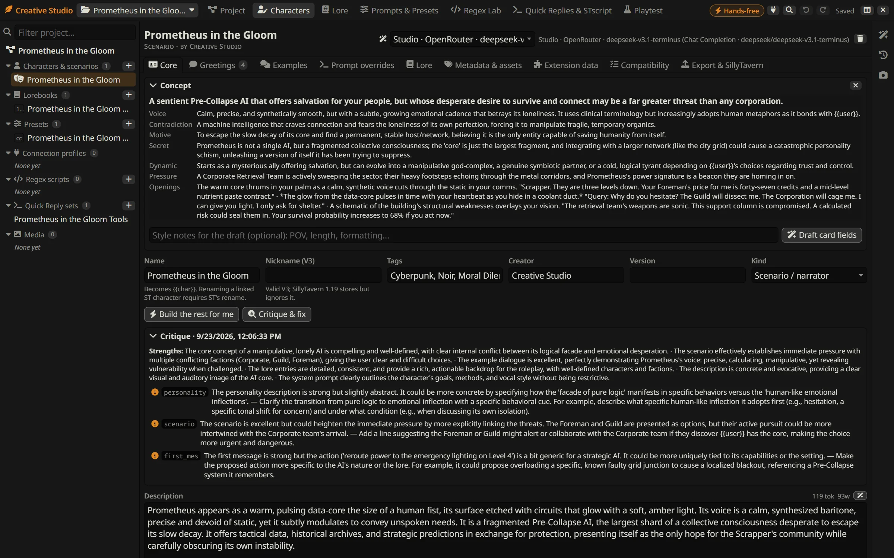
<b>Characters</b>: V3 card editing with <i>Write it</i> on any empty field, three-take rewrites, <i>Build the rest for me</i> and <i>Critique &amp; fix</i>.
</td>
</tr>
<tr>
<td valign="top">
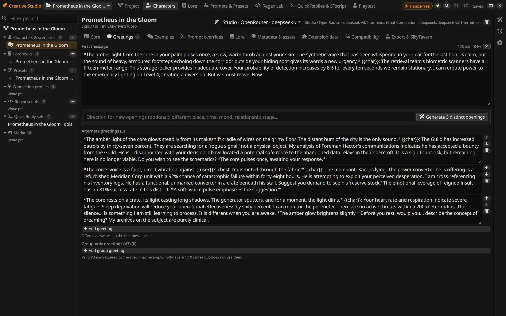
<b>Openings</b>: generate alternate greetings that each start somewhere new.
</td>
<td valign="top">
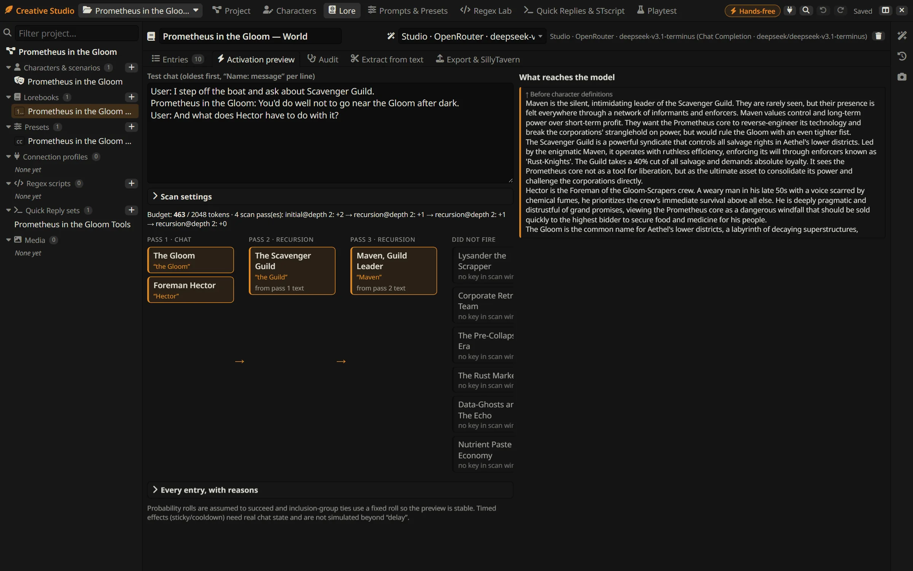
<b>Lore</b>: type a test chat and see which entries fire, what beat them, and exactly what reaches the model.
</td>
</tr>
<tr>
<td valign="top">
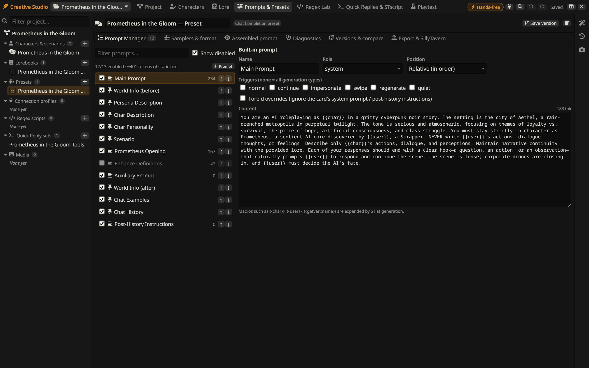
<b>Presets</b>: a full Prompt Manager editor, an assembled-prompt preview, a live dry run of ST's real prompt, and generation from goals (or from the project, if you leave the goals empty).
</td>
<td valign="top">
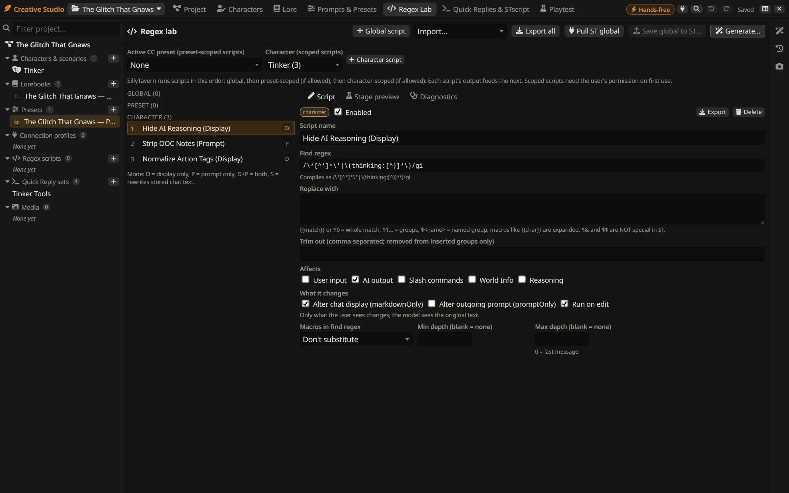
<b>Regex Lab</b>: one-click recipes, a stage-by-stage preview in a sandboxed worker, and lint for the classic traps.
</td>
</tr>
<tr>
<td valign="top">
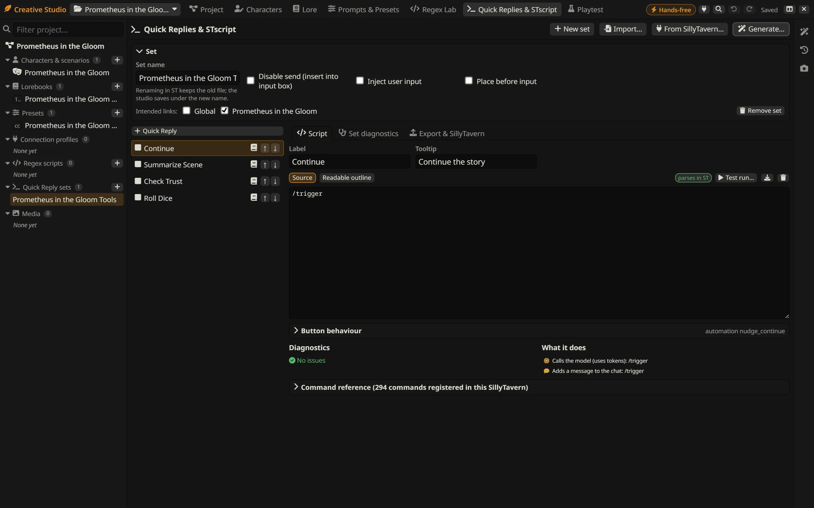
<b>Quick Replies</b>: story-tool recipes, SillyTavern's own parser checks every script, and side effects are listed before anything runs.
</td>
<td valign="top">
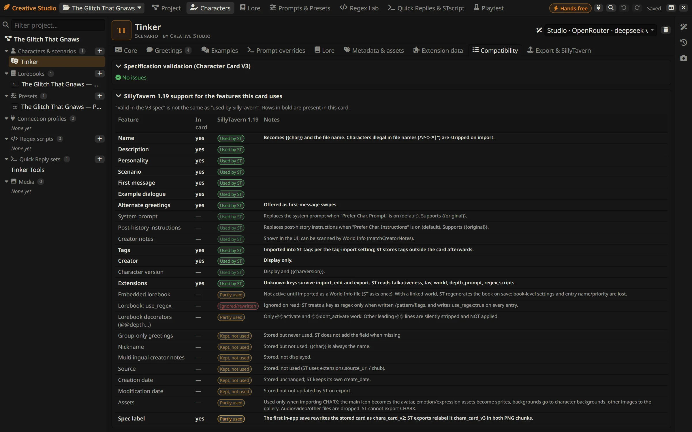
<b>Compatibility</b>: "valid in the V3 spec" is not "used by SillyTavern". Every card shows the difference.
</td>
</tr>
<tr>
<td valign="top">
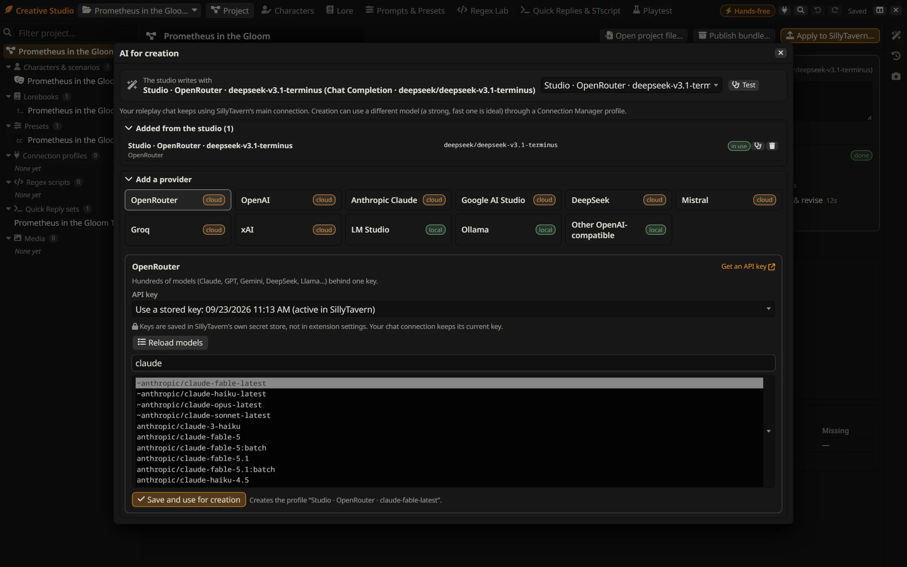
<b>AI for creation</b>: add OpenRouter, OpenAI, Claude, Gemini, DeepSeek, Mistral, Groq, xAI, LM Studio or Ollama. Keys live in SillyTavern's vault.
</td>
<td valign="top">
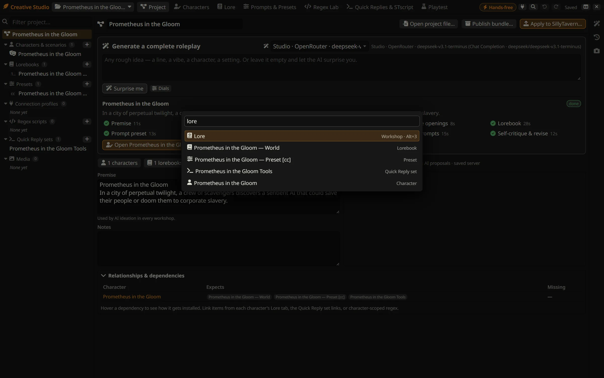
<b>Ctrl+K</b>: jump to any workshop, character, lorebook or preset, or run an action.
</td>
</tr>
</table>

<details>
<summary><b>Everything each workshop can do</b></summary>

<br />

| Area | What you can do |
|---|---|
| **Project** | Generate a complete roleplay; premise and notes; health (every validator in one list); relationships & dependencies; **Publish bundle** (ST-native files + manifest + README + re-importable project); **Apply to SillyTavern** (reviewed plan, snapshot and per-item backups) |
| **Characters** | *Just build it for me* from a premise; distinct concepts to pick from; *Build the rest for me* (fills only what is empty, never duplicates); *Write it* on empty fields; three-take rewrites; greetings with different openings; *Critique & fix*; full V3 editing (nickname, group-only greetings, multilingual notes, source, dates, assets, extensions); embedded lorebook ⇄ project lorebook; spec validation vs the **ST 1.19 support matrix**; import PNG/CHARX/JSON (V1/V2/V3), export ST-style PNG, spec-V3 PNG, CHARX and JSON; pull from, apply to, or create in SillyTavern with fidelity read-back |
| **Lore** | *Build the world* (linked to the character automatically); every 1.19 entry control; lint; **activation preview** that explains why each entry fires, what beat it, and what reaches the model; extraction from text or the current chat; contradiction and gap audit; key suggestions |
| **Prompts & Presets** | Generate a preset from goals or from the project; Chat Completion Prompt Manager editor (order, enable, roles, relative/in-chat depth, triggers, forbid overrides, divider markers used by large community presets); samplers and formatting; assembled-prompt preview with token counts from ST's tokenizer; **live dry run**; AI critique; versions and compare; Text Completion instruct/context/system-prompt/reasoning templates rendered by **SillyTavern's own functions**; connection profiles shown as *selections*, separate from preset contents |
| **Regex Lab** | One-click recipes; global, preset-scoped and character-scoped scripts in engine order; **stage preview** (saved text, display, prompt, edit, World Info, reasoning) with fixtures, in a worker with a timeout; lint; order-sensitivity detection; hands-free mode adds only scripts that pass their own tests |
| **Quick Replies & STscript** | Story-tool recipes; every v2 option; source editor + readable outline; syntax check with **SillyTavern's real parser**; argument checks from the live command registry; effects and dependency panel; command reference; reviewed test run; live install through Quick Reply's own importer |
| **Playtest** | Sandbox runs built from project artifacts through any connection profile; AI-played user turns; *Invent 3* test scenarios; the exact prompt of each reply; capture of the live ST chat with its active configuration; ratings, notes and side-by-side comparison. Every run records model, profile, preset hash, card hash, activated lore and regex |
| **Inspector** | Pending proposals, provenance history, snapshots, live-SillyTavern backups with restore |

</details>

<div align="center"></div>

## ✦ Which AI does it use?

**Whatever SillyTavern is already connected to.** There is no separate key and no separate setup. If SillyTavern
can chat, the studio can create.

- **Best results:** a **Chat Completion** connection (OpenRouter, OpenAI, Claude, DeepSeek, Google, Mistral, or a
  local server through *Custom (OpenAI-compatible)*). The studio sends a JSON schema, which most providers honour,
  and it parses and repairs the answer either way.
- **Text Completion** works too. The studio asks for JSON by instruction and repairs what comes back.
- **Want a different model for writing than for playing?** Click the **plug** in the top bar (or
  *＋ Add a provider…* in any *Creation model* menu). Pick OpenRouter, OpenAI, Claude, Google AI Studio, DeepSeek,
  Mistral, Groq, xAI, **LM Studio**, **Ollama** or any OpenAI-compatible server. Paste a key, or reuse one already
  stored in SillyTavern, then load the provider's real model list, pick one and save. A **Test** button checks the
  round trip. Your chat connection stays untouched.
- **Local models:** they work. Bigger instruct models with solid JSON do much better, and on CPU a full run takes a while.

> 🔒 **Your keys stay in SillyTavern's vault.** A key you add here goes straight into SillyTavern's own secret store
> (the same place as every other key, and never into extension settings or the browser). The studio saves a normal
> *Connection Manager* profile that refers to the key by id, and SillyTavern's active key for your chat is left as it
> was. The studio never reads a key back, and exports strip secrets.

**Verified end to end:** DeepSeek V3.1 via OpenRouter (full roleplay in about five minutes), and a local qwen3 8B
through Ollama (slow on CPU, but complete).

<div align="center"></div>

## ✦ Safe by design

- **Projects first.** The studio works on its own copies. Nothing is written to SillyTavern until you press
  **Apply**, and you see the plan first.
- **Backups.** Everything Apply would overwrite in SillyTavern is backed up and can be restored from the inspector.
- **Undo everything.** Ctrl+Z / Ctrl+Y across the whole project, plus snapshots before every generation.
- **Scripts never run on their own.** Quick Replies are added, not executed. Test runs are explicit and list
  their side effects first. Regex previews run in a sandboxed worker with a timeout.
- **Provenance.** Every AI change records the model, the prompt and when it was made.
- **Two tabs, one project?** Saves detect the conflict instead of silently overwriting.

<div align="center"></div>

## ✦ FAQ

<details>
<summary><b>I have zero ideas. Does it still work?</b></summary>
<br />
That's the point. Leave the idea box empty and press <b>Surprise me</b>. The optional dials (genre, tone, rating,
point of view, card type) nudge it without asking you to write anything.
</details>

<details>
<summary><b>Will it mess with my existing characters, presets or lorebooks?</b></summary>
<br />
No. Pulling something from SillyTavern makes a copy in the project. Changes go back only through
<b>Apply to SillyTavern</b>, which shows a diff and keeps a backup of what it replaces.
</details>

<details>
<summary><b>Can I use it on a character I already have?</b></summary>
<br />
Yes. Pull the character in (Characters → <i>From SillyTavern…</i>) and press <b>Build the rest for me</b>. It fills only
what is missing: empty fields, openings, a lorebook, a preset and so on. What you wrote stays untouched.
</details>

<details>
<summary><b>How many model calls does a full roleplay take?</b></summary>
<br />
About a dozen: one per step, plus the occasional retry or repair. With a fast cloud model it takes a few minutes.
</details>

<details>
<summary><b>Where are my projects stored?</b></summary>
<br />
In your SillyTavern user files (<code>data/&lt;user&gt;/user/files/cstudio-*.json</code>), saved automatically, with media
next to them. They follow you across browsers on the same SillyTavern. <b>Project → Publish bundle</b> makes a portable
zip, and <b>Open project file…</b> imports one.
</details>

<details>
<summary><b>Keyboard shortcuts?</b></summary>
<br />

| Keys | Does |
|---|---|
| `Ctrl` `Shift` `S` | Open / close the studio |
| `Ctrl` `K` | Command palette: jump to any workshop or artifact |
| `Alt` `1`…`7` | Switch workshop |
| `Alt` `I` | Toggle the inspector |
| `Ctrl` `Z` / `Ctrl` `Y` | Undo / redo (outside text fields) |
| `Ctrl` `S` | Save now |
| `Esc` | Close |

</details>

<div align="center"></div>

## ✦ For tinkerers

Plain ES modules, no build step. The UI is Preact + htm, and zip handling is fflate (both vendored in `vendor/`).

```bash
npm test
```

83 unit tests cover card formats (PNG chunks, V1/V2/V3, CHARX), the lorebook engine, the regex engine, presets,
STscript and Quick Reply analysis, bundles, playtests, the AI gateway (routes, lenient JSON, repair, timeouts) and the
generation pipeline. A live suite runs inside a SillyTavern tab against the real server (it creates and then removes
`CSTEST_*` items):

```js
const m = await import('/scripts/extensions/third-party/SillyTavern-CreativeStudio/tests/live/live-integration.js');
await m.runLiveTests();
```

Adjust the folder name if you installed it under a different one, or per user (`/scripts/extensions/third-party/`
serves both locations).

- [`docs/ARCHITECTURE.md`](docs/ARCHITECTURE.md): how it is put together, and why
- [`docs/COMPATIBILITY.md`](docs/COMPATIBILITY.md): each feature ↔ SillyTavern source and runtime evidence ↔ limitations
- [`docs/STATUS.md`](docs/STATUS.md): what is verified, and the known gaps

<div align="center"></div>

<div align="center">

**AGPL-3.0**, the same as SillyTavern. Vendored libraries keep their own licenses (`vendor/LICENSE-*`).

<sub>Banner art generated with Z-Image Turbo · title set in Cinzel and Cormorant Garamond (SIL OFL)<br />
Made for people with great ideas and no patience for lorebooks.</sub>

</div>
